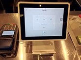
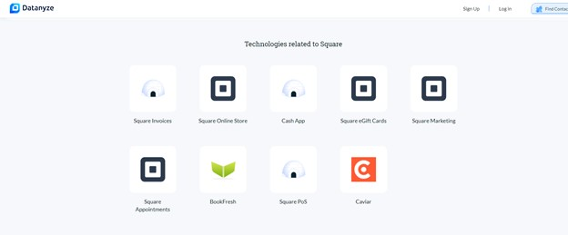
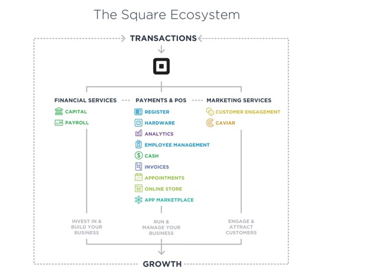
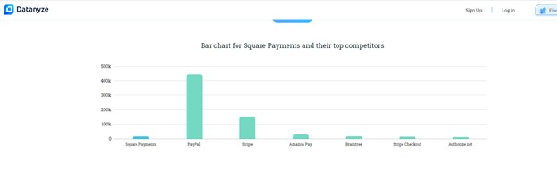
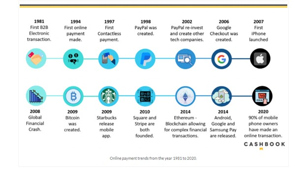
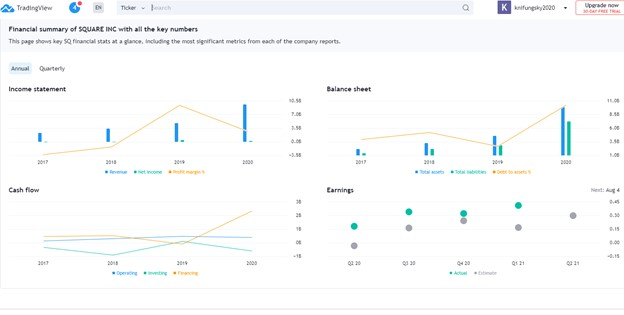

# U of T Fin Tech BootCamp Class Assignment No. 1 #

## Case Study of Square

By: Ivan Kin-Ngai Fung

Date: May 14, 2021

**Overview & Origin**

SQUARE is the company is the case study for my assignment.
Square was founded by Jack Dorsey and Jim Mckelvey in 2009.  
Prior to the starting of Square, Mckelvey was an entrepreneur in glass art works in 2009.  He lost a sale of his art works because he was unable to accept American Express credit cards to complete the sale transaction, then Mckelvey’s frustration inspired the two founders the creation of Square Terminal which could revolutionize payments by allowing anyone to accept credit card with smart phone device.
 
Square launched its first platform in 2010, and it has been trading in NYSE since 2015.  The current market capitalization is valued at about US$99.2 Billion.  The current price per share is US$210.

**Business Activities**

Square’s targeted customer group is small medium businesses which have annual payment volume of less than US$125,000.  In accordance with SBA’s 2020 survey, the total global digital payment was estimated to US$58.3 billion, and USA accounted for 35.4% of this amount.  Moreover, there were about 30 million small businesses in the US in 2020.  Small business accounted for over 99% of the overall businesses.  Square is trying to reduce the cost of setting up digital payments for small and medium businesses by providing both software and hardware to allow these business owners streamlining its digital payment operation.  

*The hardware of Square*

In 2010, Square’s device was introduced and allowed users (small-medium businesses) to accept credit card payments from their customers without the high set up cost from large financial institution such as Visa or Master card.  

By 2015, Square launched a card reader that works for Android and iOS devices thru Bluetooth to accept chip and contactless payments through their platform, and in 2018 Square introduced the terminal which can enable businesses to have display, prints receipts, and accepts chip, swipe, and contactless payments. 

To stay competitive, Square has been offering wide range of products and services with innovative technologies to their customers.  Their services and products include marketing & servicing, software, card reader, POS system, and Capital financing which are a closed e-commerce system which would are quite appealing to small and medium businesses.  

The close ecosystem would provide a one-stop shop for small and medium business to grow their businesses without any hassle with the limited resources.  Square would provide all the necessary tools for SMB to grow their businesses.   Furthermore, Square has been providing a close relationship with the small businesses which are the niche markets which large institution has been oversight in their business portfolio.
To address the security issue of the card reader, Square implemented the strong encryption on their devices to ensure all transactions are safe and secured to customers or users.  This enables Square to benefit from the first-mover’s advantages and stay ahead from the rest of the players in the markets.

**Landscape**

Square is in the domain of payment, billing and remittance within the Financial Service Industry.  The major players in this domain include Paypal, Stripe, Amazon Pay, Braintree (in the order of market share).  Square is ranking 5th overall in market share following Braintree.   

Over the last 5 to 10 years, payment domain has a disruptive innovation among the different players.   Digital payments have been continuously changing from online simple credit card transactions to mobile payments and to cryptocurrency transactions.   The trend is moving toward a cashless society where people will no longer require using cash nor cheques to settle their purchase or sale transaction.

**Results**
Square’s services have help small business to set up their digital payment application and tools to capitalize the uprising digital payments.  Small and medium businesses can easily set up a low fee digital transaction that can be safe, quick within Square’s ecosystem.
Since Square has been listed in NYSE, and we can evaluate its performances by the financial statements which are available to the public.  Since 2018, Square has been able to turn losses into profit for the 3 consecutive years, and its revenue increased significantly in 2019 prior the pandemic.  Square is making profit about $0.20 to $0.35 per share annually over the last 3 consecutive year.  

However, the market share is still small for Square comparing to big player like Paypal and Stripe.  Out of 830,000 global websites, about 18,000 domains using Square versus 448,000 websites using Paypal.     The competition is still fierce among the players in the same domain, and it is necessary for Square to continuous to grow without innovative business strategy.

**Recommendations**

If I were the advisor to Square, I would recommend two products or services for them to consider offering to their customers.  First, I would recommend them to create a cryptocurrency of its own like BitCoin which would solely use in Square’s ecosystem.  The small businesses and their customers can use this unique cryptocurrency to carry out the purchase & sale transactions.   Retail customers can simply use the Square-Coin stored in the smart phone’s wallet to purchase items from small business to complete the transaction, and the small businesses can easily convert the Square-coins back to local currencies or stored in their own e-vault for future use.  By doing so, the small business can easily complete the transaction without the conventional credit cards being involved in the transactions.     
Building on top of current Cash App, Square would require Blockchains technology, infrastructures, and capabilities to construct a platform for its users and retail customers to make transactions with its own cryptocurrency.    By doing so, Square could innovate and simplify the digital payments for small business and allow the small businesses to participate in the cryptocurrency world.

My second idea would be collaboration of marketing activities across different types for small business owners to enrich their customer base among each other.  Small business owners often have limited resources to market their products and services.  They would either need to rely on outsource contractor or to hire an in-house expert to launch marketing campaign to promote their products.  If Square can provide a service and platform for these businesses to collaborate their businesses and customers bases, then these small businesses can cross-selling their products or services by utilizing an unified platform which Square can provide with.  However, Square would need to act as a facilitator to match different sectors business owners to cultivate an environment or portal for the users to grow with each other with the assistance of Square.      By doing so, Square can reinforce its business strategy to grow with the small business owners with services which can enhance the usage of digital payments.  This collaborative strategy will not require sophisticated advance technology, but it would require machine learning or AI to match different business owners’ needs and desires across different industries.   Square should not have a lot of obstacles to initiate this model since the IT infrastructure is already there for its to further expand the business breath.
 

**Endnotes**

1. https://www.cashbook.com/changes-in-payment-trends-over-the-last-10-years/
2. Google Search https://en.wikipedia.org/wiki/Square,_Inc.#Business
3. DataAnyze https://www.datanyze.com/market-share/payment-processing--26/square-payments-market-share
4. Crunchbase https://www.crunchbase.com/organization/square
5. VentureBeat https://venturebeat.com/2015/10/18/squares-success-story-in-two-words-small-businesses/
6. Pymnets https://www.pymnts.com/news/payments-innovation/2021/new-tools-allow-developers-to-build-on-top-of-square-online/

7. Builtin https://builtin.com/fintech/fintech-payments-companies-examples
8. SBA surveys
9. Visa Digital Transformation of SMBs: The future of Commerce

 

